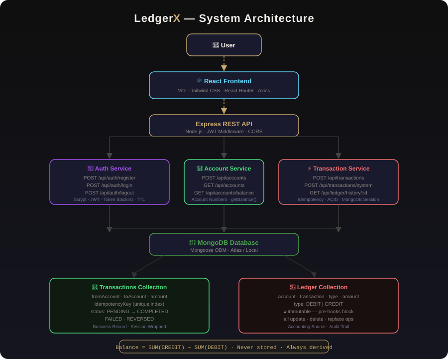
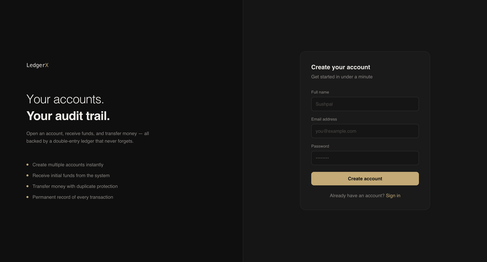
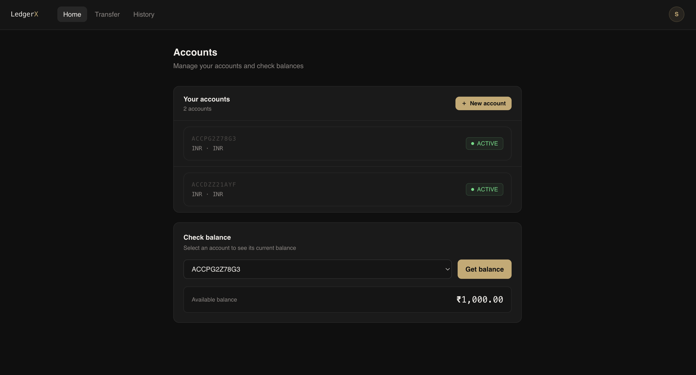
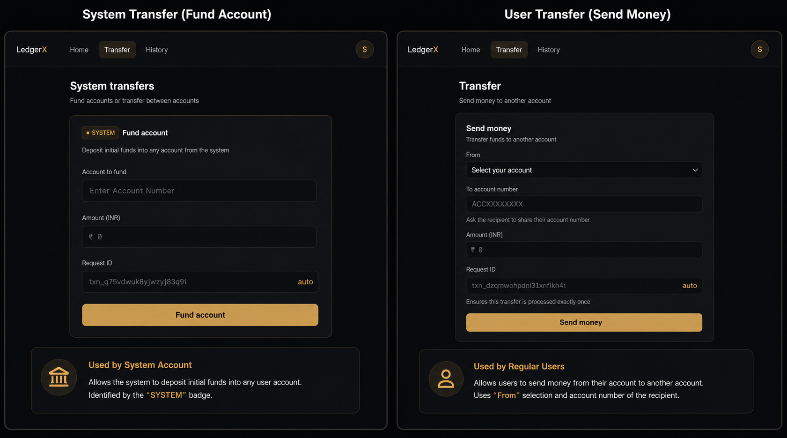
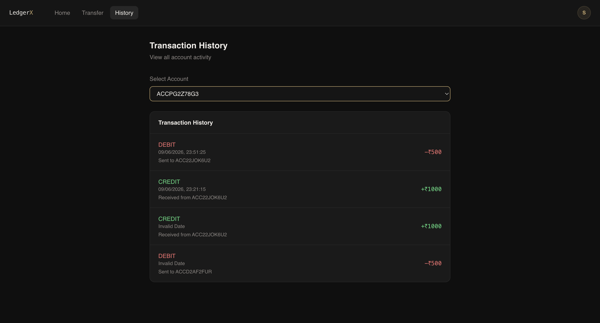

<div align="center">


# 💳 LedgerX

### Double-Entry Ledger · ACID Transactions · Idempotent Payments

A full-stack banking simulation that implements real financial system principles — double-entry accounting, atomic transactions, idempotency protection, and immutable audit trails.

</div>

---

## 📌 Problem Statement

Most banking projects store balances as a single number and update it on every transfer. This is fast, but fragile — a server crash mid-transfer can cause money to disappear from one account without arriving in another.

Real financial systems never store balances directly. Instead they derive balances from an immutable record of every credit and debit — a ledger.

LedgerX was built to explore this model:

- 💸 How do real banks ensure money never disappears during a transfer?
- 📚 How is an immutable, auditable transaction record maintained?
- 🔄 How are duplicate payment requests safely blocked?
- ⚖️ How is balance computed without ever storing it?

---

## 💡 Core Concept — Balance is Never Stored

LedgerX never stores a balance field on any account.

Every transfer creates two ledger entries — a DEBIT on the sender and a CREDIT on the receiver. Balance is always derived at query time by aggregating all entries for an account.

```
System funds Account A     →  CREDIT  +₹10,000
Account A sends ₹2,000     →  DEBIT   −₹2,000
Account A receives ₹500    →  CREDIT  +₹500

Current Balance = SUM(CREDIT) − SUM(DEBIT) = ₹8,500
```

This mirrors how banks actually work. If a transfer fails mid-way, no balance is corrupted — because no balance was ever stored. The ledger either has both entries or neither.

---

## 🏗️ System Architecture

```
                     ┌──────────────────┐
                     │      User        │
                     └────────┬─────────┘
                              │
                              ▼
                    React Frontend (Vite)
                              │
                              ▼
                   Express REST API Layer
                              │
        ┌─────────────────────┼─────────────────────┐
        ▼                     ▼                     ▼
  Auth Service         Account Service      Transaction Service
  JWT + Blacklist      Multi-Account        Transfer Engine
  bcrypt               Account Numbers      Idempotency Check
        │                     │                     │
        └─────────────────────┼─────────────────────┘
                              ▼
                       MongoDB Database
                              │
              ┌───────────────┴───────────────┐
              ▼                               ▼
         Transactions                   Ledger Entries
         (Business Record)              (Accounting Source)
         PENDING → COMPLETED            DEBIT / CREDIT
         FAILED / REVERSED              Immutable · Timestamped
```



## 📸 Screenshots

### 🔐 Registration



### 🏠 Dashboard



### 💸 Transfers



### 📜 Transaction History


---


## ⚙️ Transaction Processing Flow

Every transfer follows a strict 10-step pipeline:

```
1. Validate Request
        │
        ▼
2. Check Idempotency Key
   Already exists? → Return cached result
   New key?        → Continue
        │
        ▼
3. Verify Both Accounts Exist & Are ACTIVE
        │
        ▼
4. Derive Sender Balance from Ledger Aggregate
   Sufficient funds? → Continue
   Insufficient?     → Abort
        │
        ▼
5. Start MongoDB Session → Begin ACID Transaction
        │
        ▼
6. Create Transaction Record (status: PENDING)
        │
        ▼
7. Create DEBIT Ledger Entry (sender)
        │
        ▼
8. Create CREDIT Ledger Entry (receiver)
        │
        ▼
9. Mark Transaction COMPLETED
        │
        ▼
10. Commit Session → Both entries saved atomically
    Any failure → Automatic rollback → No partial state
```

Steps 6–10 run inside a single MongoDB session. If anything fails at any step, the entire transaction rolls back. The sender's balance is never reduced unless the receiver's balance is increased by the same amount.

---

## 🛡️ Idempotency — Duplicate Payment Protection

Every transfer is submitted with a unique Request ID generated on the frontend:

```
txn_9g6ke0tlxp51y91jj8j6
```

This key is:
- Generated once in the form component
- Displayed to the user before submission
- Sent to the backend as `idempotencyKey`
- Stored with a unique index in MongoDB

If the same request is submitted twice (network retry, double-click, page refresh), the backend detects the duplicate key and returns the original result — without processing the transfer again.

After every successful transfer, a fresh Request ID is generated so the next transfer gets its own unique key.

```
UI Request ID   ── txn_abc123
API Request ID  ── txn_abc123   ✅ Same key — user sees what backend receives
```

---

## 🔒 Immutable Ledger

Ledger entries cannot be modified or deleted after creation.

Mongoose pre-hooks block all mutation operations at the model level:

```js
ledgerSchema.pre('findOneAndUpdate', preventModification);
ledgerSchema.pre('updateOne',        preventModification);
ledgerSchema.pre('deleteOne',        preventModification);
ledgerSchema.pre('deleteMany',       preventModification);
ledgerSchema.pre('findOneAndDelete', preventModification);
ledgerSchema.pre('findOneAndReplace',preventModification);
```

This guarantees a permanent, tamper-proof audit trail of every money movement.

---

## 🔐 Authentication

- Passwords hashed with **bcrypt** before storage
- Login returns a **JWT** (7-day expiry) stored in an HTTP cookie and localStorage
- On logout, the token is added to a **blacklist collection** in MongoDB
- Blacklisted tokens auto-expire after 3 days via a **MongoDB TTL index** — no manual cleanup needed
- Every protected route checks the blacklist before trusting a token

---

## 🏦 Account Numbers

Accounts are identified by human-readable account numbers:

```
ACCPG2Z78G3
ACCD2AF2FUR
```

Transfers use account numbers — not MongoDB ObjectIds. The backend resolves the account number to an ObjectId internally. Users share account numbers, never internal database IDs.

---

## 👤 System User

A special system account (`systemledgerx@gmail.com`) can fund any account using a dedicated endpoint:

```
POST /api/transactions/system/initial-funds
```

This endpoint is protected by `authSystemUserMiddleware` — only requests authenticated as the system account can reach it. The frontend identifies the system user by email for UI rendering only. Actual authorization lives entirely in the backend middleware.

---

## ✨ Features

| Feature | Description |
|---|---|
| 🔐 JWT Authentication | Login, register, logout with token blacklist |
| 🏦 Multiple Accounts | Each user can own multiple INR accounts |
| 🔢 Account Numbers | Human-readable identifiers for transfers |
| 💰 System Funding | System account can fund any user account |
| 🔄 Fund Transfers | Transfer between accounts using account numbers |
| 📚 Double-Entry Ledger | Every transfer creates DEBIT + CREDIT entries |
| ⚖️ Derived Balance | Balance computed from ledger — never stored |
| 🛡️ Idempotency | Duplicate requests blocked at database level |
| 🔒 Immutable Entries | Ledger entries cannot be modified or deleted |
| ⚡ ACID Transactions | MongoDB sessions — atomic commit or full rollback |
| 📜 Transaction History | Full ledger history with sender/receiver account numbers |
| 🔍 Account Switching | View history for any owned account |

---

## 🎯 Engineering Concepts Demonstrated

| Concept | Implementation |
|---|---|
| **Double-Entry Accounting** | Every transfer creates exactly one DEBIT + one CREDIT entry. Balance = `SUM(CREDIT) − SUM(DEBIT)` computed at query time via MongoDB aggregate pipeline |
| **ACID Database Transactions** | MongoDB sessions wrap steps 6–10 of the transfer pipeline. If any step fails, the session rolls back — no partial state, no orphaned entries |
| **Idempotent Payment Processing** | Each transfer carries a unique `idempotencyKey` with a MongoDB unique index. The same key can never create two transactions — duplicate requests return the original result |
| **JWT Authentication & Token Revocation** | Logout adds the token to a blacklist collection. Every protected request checks the blacklist before proceeding. Blacklisted tokens auto-expire via MongoDB TTL index — no cron job needed |
| **Immutable Audit Trails** | Mongoose pre-hooks on the ledger model throw on any update, delete, or replace operation. Once written, a ledger entry is permanent |
| **Derived Balance Computation** | No balance field exists on any account document. Balance is always computed fresh from ledger entries — eliminating the class of bugs caused by stale or corrupted stored balances |
| **MongoDB Session Transactions** | `session.startTransaction()` + `session.commitTransaction()` used for atomic multi-document writes across the transaction and ledger collections |

---

## 📁 Project Structure

```
ledgerx/
│
├── README.md
│
├── docs/
│   ├── architecture.svg
│   ├── register.png
│   ├── dashboard.png
│   ├── transfer.png
│   └── history.png
│
├── backend/
│   ├── server.js
│   └── src/
│       ├── app.js
│       ├── config/
│       │   └── db.js
│       ├── controllers/
│       │   ├── auth.controller.js
│       │   ├── account.controller.js
│       │   ├── transaction.controller.js
│       │   └── ledger.controller.js
│       ├── middleware/
│       │   └── auth.middleware.js        # authMiddleware + authSystemUserMiddleware
│       ├── models/
│       │   ├── user.model.js             # bcrypt pre-save hook
│       │   ├── account.model.js          # getBalance() aggregate method
│       │   ├── transaction.model.js      # PENDING/COMPLETED/FAILED/REVERSED
│       │   ├── ledger.model.js           # immutable pre-hooks
│       │   └── blackList.model.js        # TTL index — 3 day auto-expiry
│       ├── routes/
│       │   ├── auth.route.js
│       │   ├── account.route.js
│       │   ├── transaction.route.js
│       │   └── ledger.route.js
│       ├── services/
│       │   └── email.service.js
│       └── utils/
│           └── generateAccountNumber.js  # human-readable account number generator
│
└── frontend/
    ├── index.html
    ├── vite.config.js
    ├── tailwind.config.js
    ├── postcss.config.js
    └── src/
        ├── api/
        │   ├── axios.js                  # interceptor — auto-attach JWT
        │   ├── auth.api.js
        │   ├── account.api.js
        │   ├── transaction.api.js
        │   └── ledger.api.js
        ├── components/
        │   ├── Navbar.jsx
        │   ├── AccountCard.jsx
        │   ├── BalanceCard.jsx
        │   ├── CreateAccountModal.jsx
        │   ├── TransferForm.jsx          # requestId generated here — same key sent to API
        │   ├── FundAccountForm.jsx
        │   ├── TransactionHistory.jsx
        │   ├── ProfileCard.jsx
        │   └── LoadingSpinner.jsx
        ├── context/
        │   └── AuthContext.jsx           # isSystemUser check by email
        ├── hooks/
        │   ├── useAuth.js
        │   ├── useAccounts.js
        │   ├── useTransactions.js
        │   └── useLedger.js
        ├── pages/
        │   ├── LoginPage.jsx
        │   ├── RegisterPage.jsx
        │   ├── HomePage.jsx
        │   ├── TransferPage.jsx
        │   ├── HistoryPage.jsx
        │   └── ProfilePage.jsx
        ├── routes/
        │   └── AppRoutes.jsx
        └── utils/
            ├── formatCurrency.js
            ├── formatDate.js
            └── generateRequestId.js
```

---

## 🧠 Tech Stack

| Layer | Technology | Purpose |
|---|---|---|
| Frontend | React + Vite | UI framework |
| Styling | Tailwind CSS v3 | Utility-first styling |
| Routing | React Router v6 | Client-side navigation |
| API Client | Axios | HTTP requests + JWT interceptor |
| State | React Context API | Auth state — no Redux needed |
| Backend | Node.js + Express | REST API |
| Database | MongoDB + Mongoose | Document store + ODM |
| Transactions | MongoDB Sessions | ACID atomicity |
| Auth | JWT + bcrypt | Token auth + password hashing |
| Token Expiry | MongoDB TTL Index | Auto-expire blacklisted tokens |

---

## 🚀 Getting Started

### Prerequisites

- Node.js 18+
- MongoDB running locally or a MongoDB Atlas URI

### 1. Clone the repository

```bash
git clone https://github.com/Sushpal/ledgerx.git
cd ledgerx
```

### 2. Backend setup

```bash
cd backend
npm install
```

Create `.env`:

```env
PORT=3000
MONGO_URI=your_mongodb_connection_string
JWT_SECRET=your_jwt_secret
EMAIL_USER=your_email@gmail.com
EMAIL_PASS=your_email_app_password
```

Start backend:

```bash
npm run dev
```

### 3. Frontend setup

```bash
cd frontend
npm install
```

Create `.env`:

```env
VITE_API_URL=http://localhost:3000
```

Start frontend:

```bash
npm run dev
```

Open `http://localhost:5173` 🎉

### 4. Seed the system account

Create a user in MongoDB with:

```json
{
  "email": "systemledgerx@gmail.com",
  "name": "System",
  "systemUser": true
}
```

This account can fund any user account via the system funding endpoint.

---

## 🔮 Future Enhancements

- Transaction pagination and search
- PDF account statements
- Account freeze / unfreeze
- Scheduled and recurring transfers
- Email notifications on every transaction
- Dashboard analytics and spending trends
- Role-based access control
- Docker deployment

---

## 👨‍💻 Author

**Sushpal**

Built to explore financial system design — double-entry accounting, transaction integrity, idempotency patterns, and full-stack application development.

- GitHub: https://github.com/Sushpal
- Email: nenavathsushpal4@gmail.com

---

<div align="center">

### 💳 LedgerX — Banking Beyond CRUD

<sub>Built with React · Node.js · Express · MongoDB · JWT · Tailwind CSS</sub>

</div>
